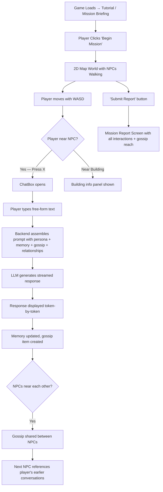
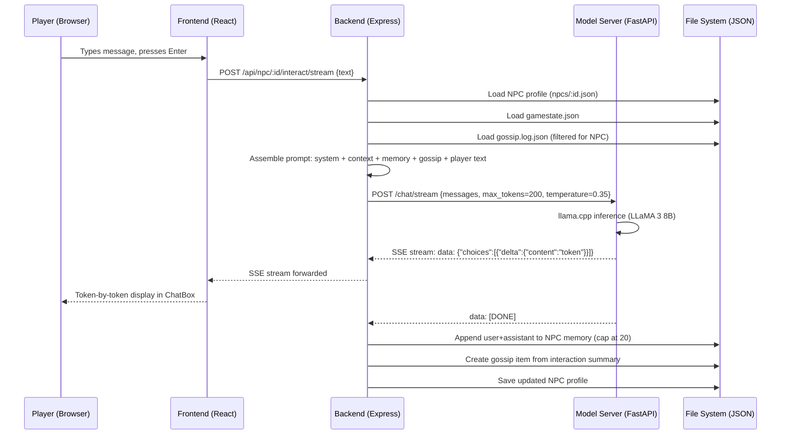
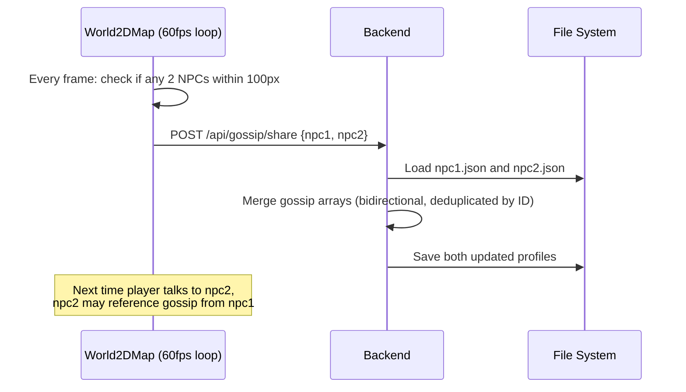
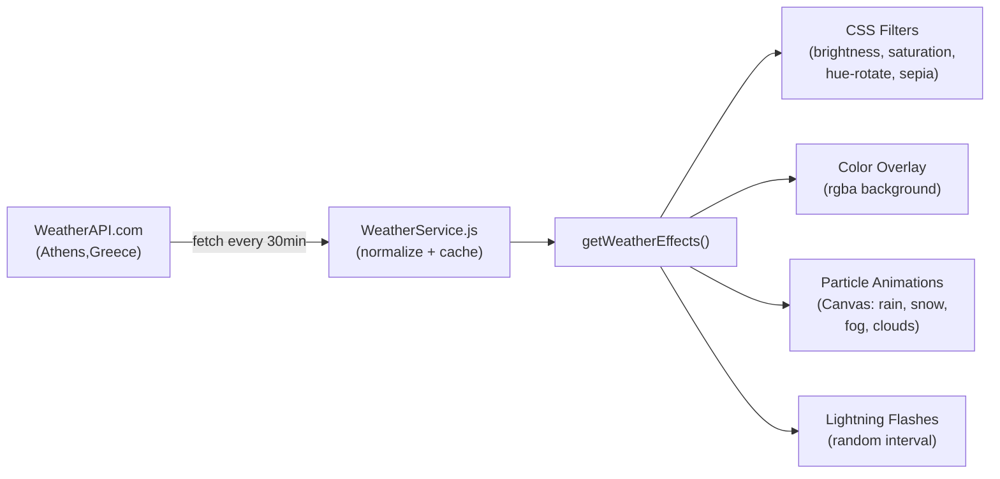

# AI_NPCs / Living Worlds — Complete Project Understanding

> **Project Name (internal):** `living-worlds-frontend` + `living-worlds-backend`
> **Repository:** [viditkaushik/AI_NPCs](https://github.com/viditkaushik/AI_NPCs)
> **Primary Language:** JavaScript (Node.js + React), Python
> **Status:** Working prototype / proof-of-concept

---

## 1. Project Goal & Real-World Purpose

**Living Worlds** is an interactive 2D role-playing game where the player explores an ancient Greek-themed city (Piraeus) and converses with AI-powered Non-Player Characters (NPCs). Each NPC is driven by a locally-hosted Large Language Model (Meta LLaMA 3 8B, quantized to GGUF) that generates dialogue in real time based on the NPC's persona, memories of past conversations, relationship dynamics, gossip propagated through a social network, and the current game state.

### The Problem It Solves

Traditional game NPCs use pre-scripted, branching dialogue trees that feel static and repetitive. This project demonstrates that:
- NPCs can have **persistent memory** of past conversations, making every interaction feel unique.
- NPCs can **share gossip** with each other when they physically cross paths on the map, creating an emergent social network the player can exploit.
- A **relationship matrix** tracks how each NPC feels about every other NPC (and the player), dynamically changing NPC behavior.
- **Real-world weather data** from the player's city is reflected as in-game visual effects (rain, snow, fog, storms, temperature-based color grading).

The real-world purpose: a research/portfolio prototype showing how LLMs can be integrated into games to create living, breathing worlds with emergent social dynamics.

---

## 2. Main Features & User Flow

### Core Features

| Feature | Description |
|---|---|
| **LLM-powered NPC Dialogue** | Free-form text conversation with 11 NPCs, each with unique personality, goals, knowledge |
| **Persistent NPC Memory** | NPCs remember last 10 interactions (20 messages) and reference them |
| **Gossip Propagation Network** | When two NPCs walk near each other, they share gossip items; an NPC can know what the player told another NPC |
| **Relationship Matrix** | Bidirectional numeric scores (-50 to +50) between all entities; affects NPC tone and dialogue options |
| **Faction System** | NPCs belong to factions (COURT_LOYALISTS, MARKET_MERCHANTS, UNDERWORLD, NEUTRAL) that shape alliances |
| **Dynamic Weather System** | Real-time weather data from WeatherAPI.com drives visual overlays (rain, snow, fog, lightning, temperature color grading) |
| **2D Map Exploration** | WASD-controlled player navigates a hand-drawn map with camera scrolling, minimap, and building markers |
| **NPC Pathfinding** | NPCs autonomously walk along predefined waypoint paths with pause-at-waypoint behavior |
| **Streaming LLM Responses** | Token-by-token Server-Sent Events streaming for responsive dialogue |
| **Audio System** | Background music, footstep SFX, NPC interaction sounds, mute/unmute toggle |
| **Mission Report Screen** | End-of-session view showing all interactions and gossip reach across NPCs |

### User Flow



---

## 3. Tech Stack & Why Each Technology Is Used

### Three-Tier Architecture

| Tier | Technology | Why |
|---|---|---|
| **Frontend** | React 18 + Vite 5 | Fast HMR for dev; React for component-based UI (ChatBox, WeatherOverlay, World2DMap) |
| **Backend** | Node.js + Express 4 | Lightweight REST API to manage NPC profiles, game state, gossip, and proxy LLM calls |
| **Model Server** | Python + FastAPI + llama-cpp-python | Serves the quantized LLaMA 3 8B model locally via `/chat` and `/chat/stream` endpoints |

### Key Libraries & Services

| Library / Service | Role |
|---|---|
| [llama-cpp-python](file:///c:/coding/AI_NPCs%20raunak/model_server/model_server.py#L10) | Python bindings for llama.cpp; runs GGUF quantized LLM on CPU/GPU |
| [FastAPI](file:///c:/coding/AI_NPCs%20raunak/model_server/model_server.py#L6) + Uvicorn | High-performance async Python web server for the model |
| [Express.js](file:///c:/coding/AI_NPCs%20raunak/backend/server.js#L3) | Node.js REST API server |
| [node-fetch](file:///c:/coding/AI_NPCs%20raunak/backend/package.json#L13) | Backend HTTP client to call the Python model server |
| [Vite](file:///c:/coding/AI_NPCs%20raunak/frontend/vite.config.js) | Frontend build tool with `/api` → `localhost:3000` proxy |
| [WeatherAPI.com](file:///c:/coding/AI_NPCs%20raunak/frontend/src/services/WeatherService.js#L42-L44) | Real-world weather data (temperature, condition, humidity, wind) |
| [Canvas API](file:///c:/coding/AI_NPCs%20raunak/frontend/src/components/WeatherAnimations.jsx) | Particle-based weather animations (raindrops, snowflakes, fog, clouds, lightning) |
| Hugging Face Hub | Model download via `hf_hub_download` for LLaMA 3 8B GGUF |

### Model Details

- **Model:** Meta LLaMA 3 8B Instruct (Q4_K_M quantization)
- **Repository:** `QuantFactory/Meta-Llama-3-8B-Instruct-GGUF`
- **File:** `Meta-Llama-3-8B-Instruct.Q4_K_M.gguf`
- **Context:** 4096 tokens
- **Inference:** `llama-cpp-python` with optional GPU offloading (`n_gpu_layers=1`)

---

## 4. Overall Architecture & Folder Structure

```
AI_NPCs/
├── backend/                          # Node.js Express API server (port 3000)
│   ├── server.js                     # Express app, routes, startup
│   ├── controllers/
│   │   └── interactController.js     # ALL request handlers: interact, stream, gossip, reset, profile
│   ├── services/
│   │   ├── LLMGateway.js             # HTTP client → Python model server (/chat, /chat/stream)
│   │   ├── PromptAssembler.js        # Builds system prompt from persona + relationships + memory + gossip
│   │   ├── RelationshipMatrix.js     # Bidirectional NPC↔NPC and Player↔NPC relationship scores
│   │   ├── DataStore.js              # JSON file persistence for relationships.json
│   │   ├── GameStateManager.js       # Manages gamestate.json (time, weather, player stats, quests)
│   │   ├── MemoryStore.js            # Per-NPC memory snippets (memory.json)
│   │   ├── NPCProfileManager.js      # Load NPC profile JSON files
│   │   ├── WeatherService.js         # Server-side weather effects on gameplay (NPC density, gossip spread)
│   │   ├── HabitService.js           # [Placeholder] Gamification — real-world habits → in-game buffs
│   │   ├── ActionExecutor.js         # Execute structured NPC actions (GiveItem, etc.)
│   │   └── SmartEventService.js      # [Placeholder] IoT/smart-home lighting integration
│   ├── data/
│   │   ├── npcs/                     # 11 NPC profile JSON files (bartender, guard, merchant, thief, etc.)
│   │   ├── areas/                    # 6 area/building JSON files (royal_court, fountain, market, etc.)
│   │   ├── relationships.json        # Relationship matrix: NPC↔NPC, Player↔NPC, factions
│   │   ├── gamestate.json            # Current game state
│   │   ├── memory.json               # Per-NPC memory store
│   │   ├── gossip.log.json           # Global gossip log
│   │   └── characters.js             # Character position definitions
│   └── package.json
│
├── frontend/                         # React + Vite (port 3001)
│   ├── src/
│   │   ├── App.jsx                   # Root component: tutorial, chat state, report toggle
│   │   ├── api.js                    # API client: interact(), interactStream()
│   │   ├── main.jsx                  # React entrypoint
│   │   ├── styles.css                # All CSS (740+ lines) — chatbox, weather, minimap, NPCCard
│   │   ├── components/
│   │   │   ├── World2DMap.jsx        # THE MAIN COMPONENT (1096 lines): map rendering, NPC movement,
│   │   │   │                         #   camera, input, gossip sharing, minimap, audio, building markers
│   │   │   ├── ChatBox.jsx           # Chat UI with streaming, typing indicator, sound effects
│   │   │   ├── NPCCard.jsx           # Info panel showing NPC/building profiles
│   │   │   ├── WeatherOverlay.jsx    # Applies CSS filters + color overlays based on weather
│   │   │   ├── WeatherAnimations.jsx # Canvas-based particle system (rain, snow, fog, clouds, lightning)
│   │   │   ├── WeatherTestPanel.jsx  # Dev tool: test weather conditions (Ctrl+W)
│   │   │   ├── ReportScreen.jsx      # Mission report with interaction log + gossip reach analysis
│   │   │   ├── World2D.jsx           # Earlier version of World2DMap (27KB)
│   │   │   ├── WorldView.jsx         # 3D world attempt using @react-three/fiber (not used in final)
│   │   │   ├── MapView.jsx           # Alternative map view (not used in final)
│   │   │   └── ...                   # Other components (InfoPanel, OpeningScene, MapContainer, etc.)
│   │   └── services/
│   │       └── WeatherService.js     # Client-side weather: API fetch, caching, effect calculation
│   ├── map.jpg                       # Hand-drawn 2816×1536 game map
│   ├── map_coordinates.json          # Tiled map editor export: polygons + point markers (89KB)
│   ├── public/assets/                # Sprites (nico.png, guard.png, etc.), audio (bg_loop.mp3, SFX)
│   ├── vite.config.js                # Dev proxy: /api → localhost:3000
│   └── package.json
│
├── model_server/                     # Python LLM inference server (port 8000)
│   ├── model_server.py               # FastAPI app: /chat, /chat/stream, /health
│   └── model.py                      # Standalone test script for LLaMA 3 inference
│
├── devcontainer/                     # VS Code Dev Container / GitHub Codespaces config
│   ├── devcontainer.json
│   └── postCreate.sh
│
└── README.md
```

---

## 5. Important Modules & What They Do

### Backend — Core Logic

#### [interactController.js](file:///c:/coding/AI_NPCs%20raunak/backend/controllers/interactController.js) (444 lines)
The **heart of the backend**. Contains all route handlers:
- **`handleInteract`** — Processes player text → loads NPC profile, game state, gossip → assembles system+context prompt → calls LLM → stores response in NPC memory → creates gossip item → returns dialogue
- **`handleInteractStream`** — Same as above but uses SSE streaming for token-by-token delivery
- **`handleGossipShare`** — Merges gossip arrays between two NPCs (bidirectional, deduped by gossip ID)
- **`handleCheckGossip`** — Checks if an NPC should proactively mention gossip about the player
- **`handleReset`** — Clears all NPC memory and gossip (called on page load for clean state)
- **`updateNpcMemory`** — Appends user+assistant messages to NPC's memory, caps at 20 messages; generates a gossip summary

#### [RelationshipMatrix.js](file:///c:/coding/AI_NPCs%20raunak/backend/services/RelationshipMatrix.js) (120 lines)
Manages a **numeric relationship graph** between all entities:
- NPC↔NPC scores stored as `"guard-merchant": 10` pairs
- Player↔NPC scores stored separately
- **Bidirectional updates with dampening**: when NPC A's relationship with B changes by Δ, the reverse (B→A) changes by `0.5 × Δ`
- **Relationship decay**: periodic decrease toward neutral for player relationships
- Scores range from -50 (hostility) to +50 (trusted friend)
- Faction assignments: `COURT_LOYALISTS`, `MARKET_MERCHANTS`, `UNDERWORLD`, `NEUTRAL`

#### [PromptAssembler.js](file:///c:/coding/AI_NPCs%20raunak/backend/services/PromptAssembler.js) (101 lines)
Constructs the LLM system prompt by combining:
1. NPC persona and personality
2. Player relationship context (hostile / suspicious / neutral / friendly / trusted friend)
3. NPC-to-NPC relationship context with sentiment labels
4. Recent memories
5. Filtered gossip with **credibility weighting** based on source trustworthiness
6. Available dialogue options (unlocked by relationship level — e.g., "Share secrets" at score ≥30)

#### [LLMGateway.js](file:///c:/coding/AI_NPCs%20raunak/backend/services/LLMGateway.js) (85 lines)
HTTP client that calls the Python model server:
- `callLocalModel()` — POST to `/chat`, returns full response
- `callLocalModelStream()` — POST to `/chat/stream`, reads SSE stream and invokes `onChunk` callback
- Supports API key authentication via `x-api-key` header

### Frontend — Core Components

#### [World2DMap.jsx](file:///c:/coding/AI_NPCs%20raunak/frontend/src/components/World2DMap.jsx) (1096 lines)
The **largest and most complex component**. Implements:
- **Game loop**: `requestAnimationFrame`-based tick at ~60fps
- **Player movement**: WASD keyboard input, speed=220 px/s, boundary clamping
- **NPC pathfinding**: Linear interpolation along waypoint arrays with 5-second pause at each waypoint
- **Camera system**: Follows player with smooth scrolling, clamped to map boundaries
- **Proximity detection**: Finds nearest NPC or building within 80px for interaction (Press X)
- **Gossip spreading**: Every frame, checks if any two NPCs are within 100px; if so, triggers `/api/gossip/share`
- **Minimap**: Fixed SVG overlay showing all entity positions and camera viewport
- **Gossip Network Graph**: Bottom-right panel showing gossip counts per NPC and active sharing
- **Audio system**: Background music loop, footstep SFX (300ms interval while moving), interaction SFX
- **Map coordinate overlay**: Renders polygon regions and point markers from Tiled map editor export

#### [ChatBox.jsx](file:///c:/coding/AI_NPCs%20raunak/frontend/src/components/ChatBox.jsx) (170 lines)
- Streaming chat UI with `interactStream()` API
- Token-by-token display with typing indicator
- Sound effects on first response token
- Auto-scroll, auto-focus, Enter-to-send

#### [WeatherOverlay.jsx](file:///c:/coding/AI_NPCs%20raunak/frontend/src/components/WeatherOverlay.jsx) + [WeatherAnimations.jsx](file:///c:/coding/AI_NPCs%20raunak/frontend/src/components/WeatherAnimations.jsx)
- Fetches real weather from WeatherAPI.com (default location: Athens, Greece)
- Applies CSS filters (brightness, saturation, sepia, hue-rotate) and color overlays
- Canvas-based particle system: rain drops, snowflakes, fog blobs, cloud particles
- Lightning flash effect for storms (random trigger, 150ms duration)
- Test mode via `Ctrl+W` panel or console commands

#### [WeatherService.js (frontend)](file:///c:/coding/AI_NPCs%20raunak/frontend/src/services/WeatherService.js) (281 lines)
- Weather data caching (30-minute expiry)
- Condition normalization (API text → standard: clear/rain/snow/fog/overcast/cloudy/storm)
- Temperature-based visual effects: 6 temperature tiers from ≥35°C (warm golden) to <5°C (cold blue)
- Each condition applies additional filter adjustments and particle animations

### Model Server

#### [model_server.py](file:///c:/coding/AI_NPCs%20raunak/model_server/model_server.py) (117 lines)
- FastAPI server hosting the LLaMA 3 8B GGUF model
- **`POST /chat`** — Non-streaming chat completion
- **`POST /chat/stream`** — Streaming SSE chat completion
- API key authentication
- Model config: 4096 context, Q4_K_M quantization, optional GPU offloading

---

## 6. Data Flow — End to End

### Player Sends a Message to an NPC



### Gossip Propagation



### Weather Effect Pipeline



---

## 7. APIs, Libraries, Databases, Models & External Services

### REST API Endpoints (Backend — Port 3000)

| Method | Endpoint | Purpose |
|---|---|---|
| POST | `/api/npc/:id/interact` | Send player text, get NPC response |
| POST | `/api/npc/:id/interact/stream` | Same, but SSE streaming |
| GET | `/api/npc/:id/check-gossip` | Check if NPC should proactively gossip |
| GET | `/api/npc/:id/profile` | Get full NPC profile JSON |
| GET | `/api/gossip` | Get gossip network (all NPCs' gossip arrays) |
| POST | `/api/gossip/share` | Share gossip between two NPCs |
| POST | `/api/reset` | Clear all NPC memory and gossip |
| GET | `/api/relationships` | Debug: full relationship matrix |
| GET | `/api/relationships/player` | Debug: player-specific relationships |
| GET | `/api/health` | Health check |

### Model Server API (Python — Port 8000)

| Method | Endpoint | Purpose |
|---|---|---|
| POST | `/chat` | Non-streaming chat completion |
| POST | `/chat/stream` | Streaming SSE chat completion |
| GET | `/health` | Health check |

### External Services

| Service | Purpose | API Used |
|---|---|---|
| **WeatherAPI.com** | Real-time weather data | `https://api.weatherapi.com/v1/current.json` |
| **Hugging Face Hub** | Model download | `hf_hub_download()` |

### "Database"

No traditional database — all state is persisted as **flat JSON files** on disk:
- `data/npcs/*.json` — NPC profiles, memory, gossip
- `data/relationships.json` — Full relationship matrix
- `data/gamestate.json` — Player stats, quests, time/weather
- `data/memory.json` — Per-NPC memory snippets
- `data/gossip.log.json` — Global gossip log

---

## 8. Algorithms, Logic & Core Implementation Details

### 1. Prompt Assembly Algorithm

The system constructs a multi-layered prompt for each NPC interaction:

```
[System] "You are {NPC_NAME}. Persona: {personality}. Traits: {traits}. Keep replies short and in-character."
[System] "Context: Location: {location}. Time: {time}. Player reputation: {reputation}. Recent gossip: {gossip}. Gossip about player: {player_gossip}"
[Memory] (Last 20 messages from this NPC's conversation history)
[User]   (Player's current message OR gossip-triggered opening)
```

Key detail: If an NPC has gossip about the player but no prior memory, the NPC **proactively brings up the gossip** instead of waiting for the player to speak.

### 2. Relationship Score Dynamics

- **Actions affect scores**: BRIBE → -15 between NPC and allied guards; HELP → +10; THREATEN → -20
- **Asymmetric propagation**: A→B delta causes B→A to change by 50% of delta
- **Score-to-sentiment mapping**:
  - ≤ -30: "strongly dislikes" / hostile
  - -29 to -10: "dislikes" / suspicious
  - -9 to 9: neutral
  - 10 to 29: "likes" / friendly
  - ≥ 30: "strongly likes" / trusted friend
- **Dialogue options unlock** at relationship thresholds (e.g., "Share secrets" at ≥30)

### 3. Gossip Credibility Weighting

When gossip passes through the network, the `processGossip()` function adds credibility context:
- If source relationship ≤ -20: "(You are skeptical of this gossip since it comes from {source}, whom you distrust)"
- If source relationship ≥ 20: "(You take this seriously since it comes from {source}, whom you trust)"

### 4. NPC Movement Algorithm

NPCs follow **waypoint-based linear interpolation**:
```
for each NPC with path [P0, P1, P2, ...]:
    t += (speed × dt) / distance(P_current, P_next)
    position = lerp(P_current, P_next, t)
    if t >= 1.0:
        advance to next segment
        pause for 5 seconds at waypoint
```

### 5. Weather Effect Calculation

Six temperature tiers × seven weather conditions = rich visual matrix:
- Temperature controls: brightness, saturation, sepia, hue-rotate
- Condition controls: additional brightness/contrast adjustments + particle animations
- Particle types: rain (100 × intensity), snow (80 × intensity), fog (20 × intensity), clouds (5), lightning (random flash at 10% × intensity per second)

### 6. Memory Management

- **Per-NPC memory**: Capped at 20 messages (10 exchanges). Oldest messages are pruned with `slice(-20)`.
- **Per-NPC gossip**: Capped at 10 items. Oldest pruned with `slice(-10)`.
- **Full reset on page load**: `POST /api/reset` clears all memory and gossip for a fresh start each session.

---

## 9. NPC Character System

The game features **11 NPCs**, each defined by a JSON profile with rich backstory:

| NPC | Full Name | Role | Faction | Key Knowledge |
|---|---|---|---|---|
| `bartender` | Robert Desmos | The Bartender | MARKET_MERCHANTS | Knows Dorian, heard rumors about Helios, remembers favors |
| `guard` | Erebus Kappas | The Jaded Guard | COURT_LOYALISTS | Knows guest lists, accepts specific bribes |
| `guard2` | (Royal Guard) | Royal Guard | COURT_LOYALISTS | Allied with guard |
| `merchant` | Merek Moachivitis | The Merchant | MARKET_MERCHANTS | Can procure fake ledger, trades goods |
| `thief`/`helios` | Helios Voulgourais | Former Prisoner | UNDERWORLD | Knows guard patrols, bribe preferences, grudge against court |
| `moody_old_man` | Dorian Andreas | Moody Old Man | NEUTRAL | Former royal advisor, knows Helios |
| `old_man` | (Duplicate of above) | Old Man | — | Same as moody_old_man |
| `woman_1` | Woman | NPC | — | Background character |
| `woman_2` | Woman 2 | NPC | — | Background character |
| `boy` | Boy | NPC | — | Background character |

### Narrative Setting

The player is **Nico Stavrakos**, the secret bastard son of the King of Athens. Sent undercover to Piraeus by a rival faction, the player's mission is to infiltrate the Royal Court, gather intelligence, and build a network of allies — ultimately aiming to claim the throne. The city features locations like The Royal Court, The Desmos Inn (tavern), The Moachivitis Market, The Fountain of Elders, Old Ruins, and The Garden — each with lore descriptions.

---

## 10. Setup & Run Instructions

### Prerequisites
- **Node.js** ≥ 18
- **Python** ≥ 3.8 with pip
- ~5GB disk for the LLaMA 3 8B GGUF model
- (Optional) GPU with CUDA/Metal support for faster inference

### Step 1: Download the LLM Model
```bash
# Install dependencies
pip install llama-cpp-python huggingface-hub fastapi uvicorn

# Download model (automatic via huggingface_hub)
python model_server/model.py
# Or manually download: QuantFactory/Meta-Llama-3-8B-Instruct-GGUF → Q4_K_M.gguf
```

### Step 2: Start the Model Server (Port 8000)
```bash
cd model_server
python model_server.py
# Or: uvicorn model_server:app --host 127.0.0.1 --port 8000
```

### Step 3: Start the Backend (Port 3000)
```bash
cd backend
npm install
npm run dev   # or: node server.js
```

### Step 4: Start the Frontend (Port 3001)
```bash
cd frontend
npm install

# Configure .env:
# VITE_WEATHER_API_KEY=your_key_from_weatherapi.com
# VITE_WEATHER_TEST_MODE=false

npm run dev
```

### Step 5: Open the Game
Navigate to `http://localhost:3001`

### Dev Container (GitHub Codespaces)
The project includes a [devcontainer configuration](file:///c:/coding/AI_NPCs%20raunak/devcontainer/devcontainer.json) for one-click setup in GitHub Codespaces with auto port forwarding.

---

## 11. Limitations, Assumptions & Possible Improvements

### Current Limitations

| Limitation | Details |
|---|---|
| **No database** | All state in flat JSON files; concurrent writes risk data corruption |
| **No authentication** | Open API; anyone can call endpoints |
| **Reset on page load** | All NPC memory and gossip wiped on every browser refresh |
| **CPU-bound LLM inference** | LLaMA 3 8B on CPU is slow (~5-15s per response); needs GPU for real-time feel |
| **Hardcoded NPC positions** | Character definitions and building coordinates are duplicated across frontend components |
| **No collision detection** | Player can walk through walls, buildings, and NPCs |
| **Weather effects CPU-intensive** | Canvas particle system runs every frame with no FPS throttling |
| **Gossip spam** | Gossip sharing triggers on every frame two NPCs are near (no cooldown) |
| **Duplicate code** | Two `handleInteract` function definitions exist (lines 95 and 179 in interactController.js) |
| **Some services are stubs** | HabitService, SmartEventService, ActionExecutor are partially implemented |
| **No save/load game** | Game state only persists during server uptime; resets on restart |

### Assumptions

- The model server is running locally on the same machine or LAN
- The WeatherAPI key is valid and not rate-limited
- The browser supports `ReadableStream`, `requestAnimationFrame`, and Web Audio API
- Single player only (no multiplayer support)

### Possible Improvements

1. **Replace JSON files with SQLite or Redis** for reliable concurrent state persistence
2. **Add gossip cooldown** — debounce sharing to once per NPC pair per N seconds
3. **Implement collision detection** using the polygon data from `map_coordinates.json`
4. **Add save/load functionality** with named save slots
5. **Integrate vector embeddings** for semantic memory retrieval (RAG) instead of last-N message window
6. **Add NPC-to-NPC autonomous conversations** that happen independently of the player
7. **Implement the HabitService** — connect real fitness/study data to in-game buffs
8. **Implement SmartEventService** — trigger smart home lights/scenes based on game events
9. **Add multiplayer** with WebSocket-based real-time state sync
10. **Optimize the game loop** — separate render from physics tick, add spatial hashing for proximity checks
11. **De-duplicate code** — extract shared NPC coordinate/building data to a single config file

---

## 12. Interesting / Impressive Points for Resume & Interviews

### What Makes This Project Stand Out

1. **Full-stack LLM integration at the systems level** — Not just an API call to OpenAI. This project runs a quantized Meta LLaMA 3 8B model locally using llama.cpp, wraps it in a FastAPI streaming server, and integrates it into a game engine through a multi-layer prompt assembly pipeline.

2. **Emergent NPC social dynamics** — The gossip propagation system creates genuinely emergent behavior: what you tell one NPC can spread through proximity-based interaction to other NPCs, who will reference it in future conversations. This is a non-trivial social simulation.

3. **Multi-dimensional relationship system** — Bidirectional relationship scores with asymmetric dampening, faction-based alliances, credibility-weighted gossip filtering, and score-gated dialogue options. This goes well beyond binary friend/foe states.

4. **Real-world data integration** — Live weather from WeatherAPI.com is translated into visual effects via a 6-tier temperature model × 7-condition matrix, rendered with a custom Canvas particle system.

5. **Token-by-token streaming** — End-to-end SSE streaming from the Python model server through the Node.js backend to the React frontend, giving a responsive "NPC is talking" experience.

6. **Rich narrative design** — The game isn't just a tech demo; it has a coherent story world with interconnected characters, lore-rich locations, faction politics, and a mission structure.

---

## 13. Resume-Ready Bullet Points

> Adapt these based on your exact contributions. If this was a team project, specify your role.

- **Architected and built a three-tier AI game system** (React + Node.js + Python) featuring 11 NPC characters driven by a locally-hosted Meta LLaMA 3 8B model with token-by-token SSE streaming, achieving real-time conversational AI without cloud API dependencies.

- **Designed and implemented a gossip propagation engine** where NPC social dynamics emerge from proximity-based information sharing, persistent memory (20-message windows), and credibility-weighted gossip filtering — creating uniquely emergent gameplay interactions.

- **Engineered a bidirectional relationship matrix** with asymmetric propagation dampening, faction alignment, and score-gated dialogue options, enabling NPCs to dynamically shift between hostility, neutrality, and trust based on player actions (BRIBE/HELP/THREATEN mechanics).

- **Integrated real-time weather data** (WeatherAPI.com) into a custom Canvas-based particle rendering system supporting 7 weather conditions (rain, snow, fog, storm, overcast, cloudy, clear) with temperature-dependent color grading across 6 thermal tiers.

- **Built a 2D game engine from scratch** using React and Canvas APIs with 60fps `requestAnimationFrame` loop, waypoint-based NPC pathfinding with pause behavior, WASD movement, camera scrolling, minimap, audio system, and interactive building/NPC proximity detection.

- **Deployed a local LLM inference server** using `llama-cpp-python` and FastAPI, serving a Q4_K_M quantized 8B-parameter model with 4096 token context, optional GPU offloading, and API key authentication for secure local-network access.

---

## Appendix: Key File Quick Reference

| What you want to understand | Read this file |
|---|---|
| How NPC dialogue is generated | [interactController.js](file:///c:/coding/AI_NPCs%20raunak/backend/controllers/interactController.js) |
| How prompts are assembled | [PromptAssembler.js](file:///c:/coding/AI_NPCs%20raunak/backend/services/PromptAssembler.js) |
| How relationships work | [RelationshipMatrix.js](file:///c:/coding/AI_NPCs%20raunak/backend/services/RelationshipMatrix.js) |
| How the LLM is called | [LLMGateway.js](file:///c:/coding/AI_NPCs%20raunak/backend/services/LLMGateway.js) |
| How the LLM model is served | [model_server.py](file:///c:/coding/AI_NPCs%20raunak/model_server/model_server.py) |
| How the game world renders | [World2DMap.jsx](file:///c:/coding/AI_NPCs%20raunak/frontend/src/components/World2DMap.jsx) |
| How chat streaming works | [ChatBox.jsx](file:///c:/coding/AI_NPCs%20raunak/frontend/src/components/ChatBox.jsx) + [api.js](file:///c:/coding/AI_NPCs%20raunak/frontend/src/api.js) |
| How weather effects work | [WeatherService.js](file:///c:/coding/AI_NPCs%20raunak/frontend/src/services/WeatherService.js) + [WeatherAnimations.jsx](file:///c:/coding/AI_NPCs%20raunak/frontend/src/components/WeatherAnimations.jsx) |
| NPC character data | [backend/data/npcs/](file:///c:/coding/AI_NPCs%20raunak/backend/data/npcs) |
| Relationship initial state | [relationships.json](file:///c:/coding/AI_NPCs%20raunak/backend/data/relationships.json) |
| Game state & player info | [gamestate.json](file:///c:/coding/AI_NPCs%20raunak/backend/data/gamestate.json) |
